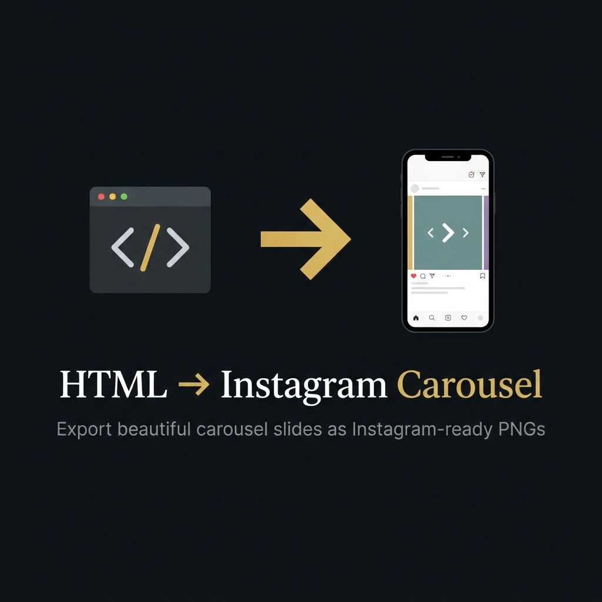
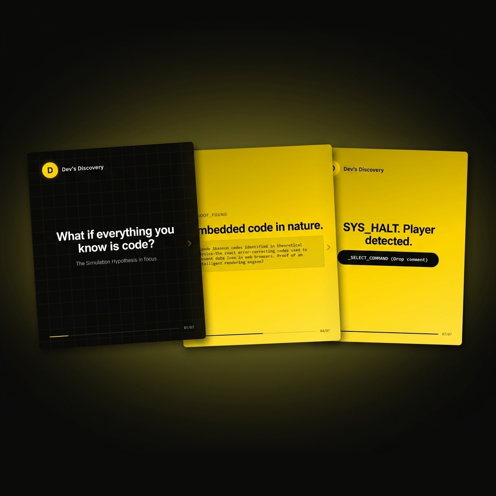
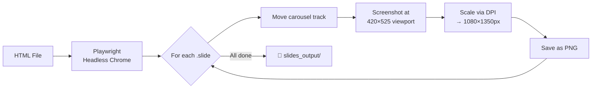

<div align="center">



# HTML to Instagram Carousel

**Export any HTML carousel into pixel-perfect, Instagram-ready PNG slides.**

[](https://python.org)
[](https://playwright.dev/python/)
[](LICENSE)
[](CONTRIBUTING.md)

[Getting Started](#-getting-started) · [How It Works](#-how-it-works) · [Examples](#-example-output) · [AI Prompt Template](#-ai-prompt-template) · [Contributing](#-contributing)

</div>

---

## 🎯 What Is This?

A command-line tool that takes an HTML carousel file and exports each slide as an individual **1080×1350px PNG** — the exact resolution Instagram recommends for carousel posts.

**The workflow:**

```
You (or AI) design a carousel in HTML/CSS
         ↓
   Run one command
         ↓
  Get Instagram-ready PNGs
         ↓
   Upload directly to IG 🚀
```

> 💡 **Why HTML?** Because HTML gives you unlimited design control — custom fonts, gradients, SVGs, animations-turned-static, pixel-perfect layouts. No Canva limitations, no Figma exports, no design tool lock-in.

---

## ✨ Features

| Feature | Description |
|---------|-------------|
| 🎨 **Pixel-perfect export** | 1080×1350px PNGs at exact Instagram carousel spec |
| 🔤 **Google Fonts support** | Auto-waits for web fonts to load before capture |
| 📐 **Smart scaling** | Renders at 420px, scales to 1080px via DPI — no layout distortion |
| 🔁 **Non-destructive exports** | Re-running never overwrites previous exports |
| ⚡ **Zero config** | Auto-installs Playwright + Chromium on first run |
| 📁 **Organized output** | Files named from your HTML filename, numbered by slide |
| 🤖 **AI-ready prompt** | Included prompt template to generate carousels with ChatGPT/Claude |

---

## 📸 Example Output

<div align="center">



<sub>Slides exported from the included <code>matrix_minimal_carousel.html</code> example</sub>

</div>

---

## 🚀 Getting Started

### Prerequisites

- **Python 3.10+** — [Download here](https://www.python.org/downloads/)

### Installation

```bash
# Clone the repo
git clone https://github.com/DJ-vekariya/html-to-Instagram-carousel.git
cd html-to-Instagram-carousel

# That's it. No pip install needed — the script handles dependencies automatically.
```

### Run Your First Export

```bash
# Export the included example carousel
python main.py matrix_minimal_carousel.html
```

On first run, the script will:
1. Install `playwright` Python package (if missing)
2. Download Chromium browser (if missing)
3. Export all slides to `slides_output/`

**That first run takes ~30 seconds.** Subsequent runs are fast.

---

## 📖 Usage

### Basic

```bash
python main.py your-carousel.html
```

### Custom output folder

```bash
python main.py your-carousel.html --output-dir my_exports
```

### Custom font wait time

If your HTML uses heavy web fonts that need more loading time:

```bash
python main.py your-carousel.html --font-wait-ms 5000
```

### Help

```bash
python main.py --help
```

---

## ⚙️ How It Works



### The DPI Scaling Trick

Instead of rendering at 1080px wide (which would break layouts), the tool:

1. Opens the HTML at **420×525px** — the design viewport
2. Sets `device_scale_factor` to **2.5714** (= 1080 ÷ 420)
3. The browser renders at high DPI — like a Retina display
4. The screenshot captures **1080×1350px** without any layout reflow

> This is the same approach Apple uses for Retina displays. The layout stays at 420px, but every pixel is rendered at 2.57× density.

---

## 📐 HTML Requirements

Your carousel HTML must follow this structure:

```html
<div class="ig-frame">
  <div class="carousel-viewport">
    <div class="carousel-track">
      <section class="slide"><!-- Slide 1 --></section>
      <section class="slide"><!-- Slide 2 --></section>
      <section class="slide"><!-- Slide 3 --></section>
    </div>
  </div>
</div>
```

**What the exporter does automatically:**
- Counts slides from `.carousel-track .slide`
- Hides Instagram UI chrome: `.ig-header`, `.ig-dots`, `.ig-actions`, `.ig-caption`
- Sets the viewport to 420×525px
- Disables slide transition animations

---

## 🤖 AI Prompt Template

This repo includes a **ready-to-use prompt template** (`prompt.txt`) that you can paste into ChatGPT, Claude, or any AI assistant to generate carousel HTML that works perfectly with this exporter.

**The prompt instructs the AI to:**
- Ask for your brand colors, fonts, and tone
- Generate a complete HTML carousel with the correct class structure
- Include progress bars, swipe arrows, and proper 4:5 aspect ratio
- Use Google Fonts with proper loading
- Follow light/dark slide alternation for visual rhythm

### Quick Start with AI

1. Copy the contents of `prompt.txt`
2. Paste it as a system prompt in your AI assistant
3. Ask: *"Create a carousel about [your topic] for @[your_handle]"*
4. Save the generated HTML
5. Run: `python main.py your-carousel.html`
6. Upload the PNGs to Instagram ✨

---

## 📁 Project Structure

```
html-to-Instagram-carousel/
├── main.py                          # The export engine
├── prompt.txt                       # AI prompt template for generating carousels
├── matrix_minimal_carousel.html     # Example carousel (dark theme, gold accent)
├── requirements.txt                 # Python dependencies
├── assets/                          # README images
│   ├── banner.png
│   └── demo-preview.png
├── slides_output/                   # Exported PNGs land here (git-ignored)
├── CONTRIBUTING.md                  # Contribution guidelines
├── LICENSE                          # MIT License
└── README.md                        # You are here
```

---

## 🛠️ Troubleshooting

<details>
<summary><strong>Permission error during auto-install</strong></summary>

Create a virtual environment:

```bash
python -m venv .venv

# Windows
.venv\Scripts\activate

# macOS/Linux
source .venv/bin/activate

python main.py your-carousel.html
```

</details>

<details>
<summary><strong>Multiple HTML files found</strong></summary>

Pass the filename explicitly:

```bash
python main.py my-carousel.html
```

</details>

<details>
<summary><strong>Fonts look wrong in exports</strong></summary>

Increase the font wait time:

```bash
python main.py your-carousel.html --font-wait-ms 5000
```

</details>

<details>
<summary><strong>Chromium download is slow</strong></summary>

The first Chromium download is ~150MB. Subsequent runs use the cached browser. If it fails, check your internet connection and try again.

</details>

---

## 🤝 Contributing

Contributions are welcome! Check the [Contributing Guide](CONTRIBUTING.md) for details.

**Good first contributions:**
- Add new example carousel HTML files
- Improve error messages
- Add export format options (WebP, JPEG)
- Add batch export for multiple HTML files

---

## 📄 License

This project is licensed under the MIT License — see the [LICENSE](LICENSE) file for details.

---

<div align="center">

**Built with ❤️ by [DJ Vekariya](https://github.com/DJ-vekariya)**

If this tool saved you time, consider giving it a ⭐

</div>
